# Как это работает?

## Загрузка

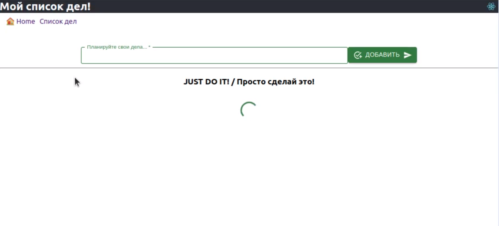
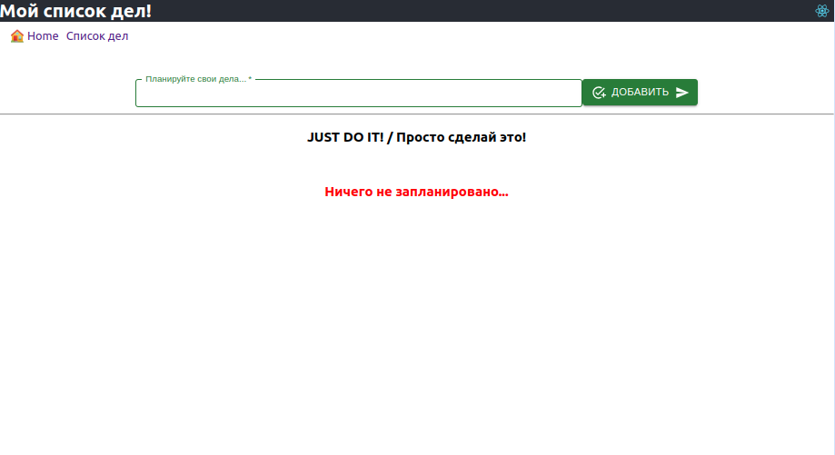

## Добавляем пункты в список дел

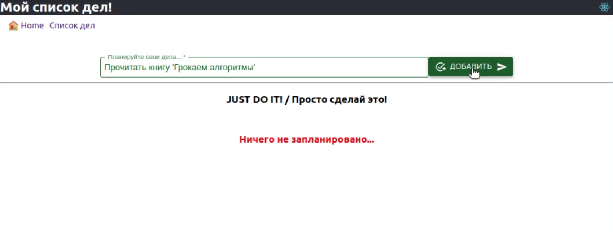
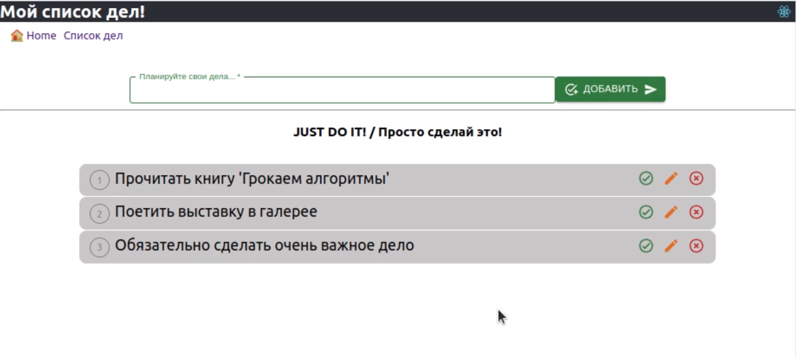

## Для изменения статуса кликаем ✅

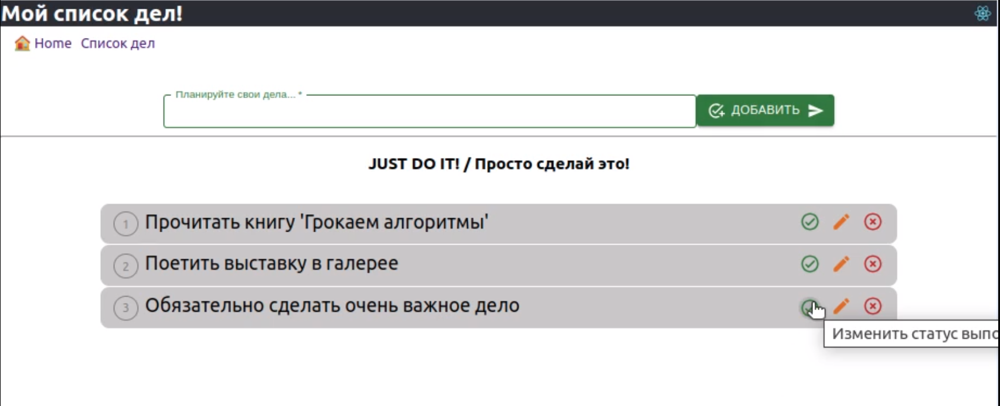
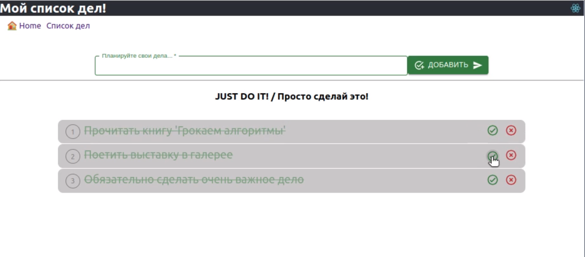

## Для внесения изменений кликаем ✏️

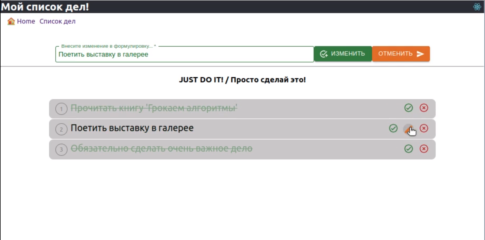
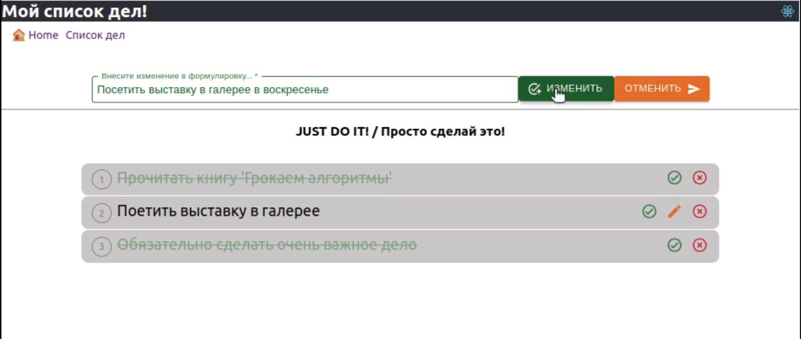

## Для удаление записи из списка кликаем ❌

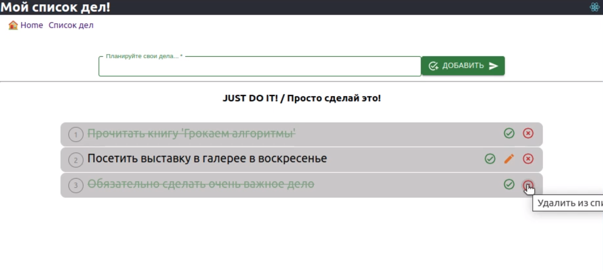
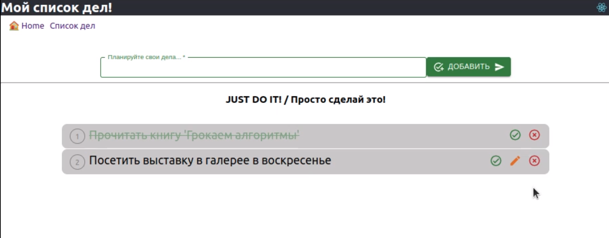

## И так далее... добавляем ... отмечаем выполение ...

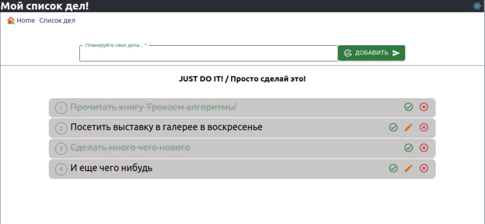

# Чтобы запустить приложение на своем компьютере

## 1. Скачайте приложение из репозитория, используя команду

```
git clone <SSH Key>
```

## 2. Подготовительная работа с серверной частью приложения

1. Перейдите в папку server
2. Установите node_modules в папке server

```
cd server
npm install
```

3. внесите необходимую информацию в файл '.env' по шаблону из файла '.env.example'
4. Создайте базу данных
5. Накатите миграции и сиды

```
npx sequelize-cli db:create
npx sequelize-cli db:migrate
npx sequelize-cli db:seed:all
```

6. Запустите сервер

```
npm run dev
```

## 3. Подготовительная работа с клиентской частью приложения

1. Установите node_modules в папке client

```
cd ../
cd client
npm install
```

2. Запустите приложение

```
npm start
```
